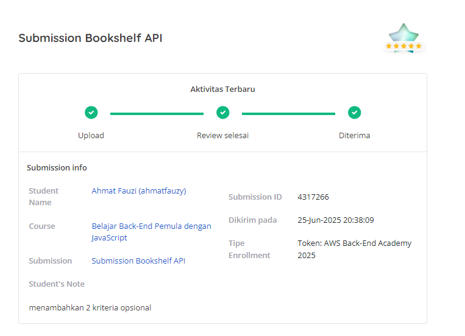

# 🏆 Achievement - Bookshelf API Project

## 🌟 Project Review Score

---

## 📊 Review Results

*Screenshot review dari Dicoding Academy*

---

## ✅ Kriteria yang Dipenuhi

### 🎯 **Kriteria Wajib (7/7)**
- ✅ **Port 9000** - Aplikasi berjalan di port yang sesuai
- ✅ **npm run start** - Script start tersedia dan berfungsi
- ✅ **POST /books** - API dapat menyimpan buku dengan validasi lengkap
- ✅ **GET /books** - API dapat menampilkan seluruh buku
- ✅ **GET /books/{id}** - API dapat menampilkan detail buku
- ✅ **PUT /books/{id}** - API dapat mengubah data buku
- ✅ **DELETE /books/{id}** - API dapat menghapus buku

### 🚀 **Kriteria Opsional (2/2)**
- ✅ **Query Parameters** - Filtering dengan `name`, `reading`, `finished`
- ✅ **ESLint Integration** - Code quality dengan Airbnb style guide

---

## 🛠️ Tech Stack & Tools

---

## 📈 Project Statistics

| Metric | Value |
|--------|-------|
| **Total Files** | 7 files |
| **Lines of Code** | ~300 LOC |
| **API Endpoints** | 5 endpoints |
| **Response Formats** | JSON REST API |
| **Validation Rules** | 4 validation rules |
| **Error Handling** | Complete error responses |
| **Code Quality** | ESLint passed ✅ |

---

## 🎯 Key Features Implemented

### 📚 **CRUD Operations**
- **Create** - Add new books with validation
- **Read** - Get all books & individual book details  
- **Update** - Modify existing book data
- **Delete** - Remove books from collection

### 🔍 **Advanced Filtering**
- **Name Search** - Case-insensitive book name filtering
- **Reading Status** - Filter by currently reading books
- **Finished Status** - Filter by completed books
- **Combined Filters** - Multiple query parameters support

### ✨ **Data Management**
- **Auto-generated IDs** - Using nanoid for unique identifiers
- **Timestamp Tracking** - insertedAt & updatedAt fields
- **Status Calculation** - Auto-calculate finished status
- **In-memory Storage** - Fast data access without database dependency

---

## 🏅 Learning Outcomes

### 💡 **Technical Skills Gained**
- ✅ **REST API Design** - Proper HTTP methods and status codes
- ✅ **Hapi.js Framework** - Server setup and routing
- ✅ **Request Validation** - Input sanitization and error handling
- ✅ **Code Quality** - ESLint integration and best practices
- ✅ **API Documentation** - Comprehensive README with examples

### 🎓 **Best Practices Applied**
- ✅ **Separation of Concerns** - Routes, handlers, and data separated
- ✅ **Error Handling** - Consistent error response format
- ✅ **Code Style** - Airbnb ESLint configuration
- ✅ **Documentation** - Clear API documentation with examples
- ✅ **Testing Ready** - Structure ready for unit testing

---

## 🚀 Project Highlights

### 🔧 **Developer Experience**
- ESLint for code quality
- Nodemon for development
- Clear error messages
- Consistent response format

---

*Project completed as part of Dicoding Academy's Backend Development Learning Path*
